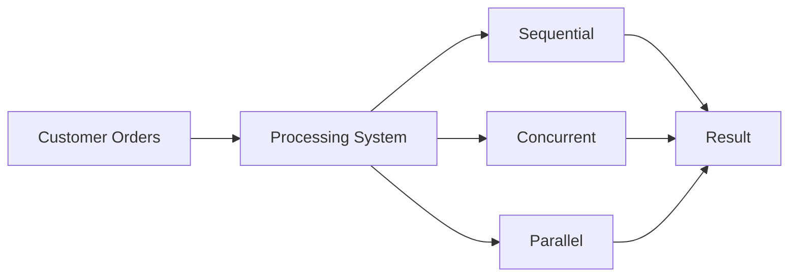

# 🚀 CONCURRENT AND PARALLEL FOOD ORDERING SYSTEM ANALYSING

  
  
  

---

## 🍔 Project Overview

> “When thousands of customers order food at the same time… can your system keep up?”

This project simulates a food ordering system that processes a large number of customer orders and compares performance using different execution techniques.

---

## 🎯 Objectives

- Implement multiple processing techniques  
- Simulate large-scale order handling  
- Measure execution performance  
- Compare efficiency between methods  

---

## ❗ Problem Statement

In real-world systems such as food delivery platforms, handling large volumes of orders using sequential processing can lead to slow performance and delays.

This project explores how concurrent and parallel processing can improve system efficiency.

---

## ⚙️ System Environment

| Parameter | Details |
|----------|--------|
| 💻 OS | Kali Linux / Windows |
| 🐍 Python | Python 3.x |
| ⚙️ CPU | 8-Core Processor |
| 🚀 Modes | Sequential, Threading, Multiprocessing |

---

## 🧠 System Flow

---

## 🧠 Code Insight

🔹 Parallel Processing Example

with Pool(processes=cores) as pool:
    results = pool.map(process_order, orders, chunksize=200)

✔ Distributes tasks across multiple CPU cores

✔ Reduces execution time

✔ Improves system performance

